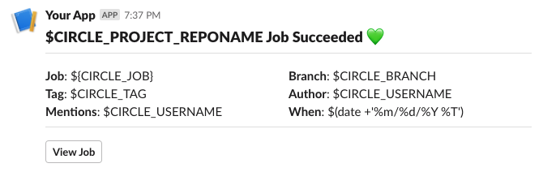

# CircleCI Slack Orb

[](https://circleci.com/gh/usertech/circleci-slack-orb) [](https://circleci.com/orbs/registry/orb/usertech/circleci-slack-orb) [](https://raw.githubusercontent.com/usertech/circleci-slack-orb/master/LICENSE) [](https://discuss.circleci.com/c/ecosystem/orbs)

## Usage

### Setup

In order to use the Slack Orb on CircleCI you will need to create a Slack App and provide an OAuth token. Find the guide in the wiki: [How to setup Slack orb](https://github.com/CircleCI-Public/slack-orb/wiki/Setup)

### Use In Config

For full usage guidelines, see the [Orb Registry listing](https://circleci.com/developer/orbs/orb/usertech/circleci-slack-orb).
For setup guide see the [Wiki](https://github.com/CircleCI-Public/slack-orb/wiki) from source.

## Templates

The Slack Orb comes with a number of included templates to get your started with minimal setup. Feel free to use an included template or create your own.

| Template Preview  | Template  | Description |
| ------------- | ------------- | ------------- |
|   | default_pass_1   | Should be used with the "pass" event. |
|   | default_fail_1   | Should be used with the "fail" event. |
|   | default_on_hold_1   | To be used in the on-hold job. _see orb [usage examples](https://circleci.com/developer/orbs/orb/usertech/circleci-slack-orb#usage-example)_  |


## Custom Message Template

  1. Open the Slack Block Kit Builder: https://app.slack.com/block-kit-builder/
  2. Design your desired notification message.
  3. Replace any placeholder values with $ENV environment variable strings.
  4. Set the resulting code as the value for your `custom` parameter.

  ```yaml
- slack/notify:
      event: always
      custom: |
        {
          "blocks": [
            {
              "type": "section",
              "fields": [
                {
                  "type": "plain_text",
                  "text": "*This is a text notification*",
                  "emoji": true
                }
              ]
            }
          ]
        }
  ```

## Branch or Tag Filtering

Limit Slack notifications to particular branches with the "branch_pattern" or "tag_pattern" parameter.

```
A comma separated list of regex matchable branch or tag names. Notifications will only be sent if sent from a job from these branches/tags. By default ".+" will be used to match all branches/tags. Pattern must match the full string, no partial matches. Keep in mind that "branch_pattern" and "tag_pattern" are mutually exclusive.
```

See [usage examples](https://circleci.com/developer/orbs/orb/usertech/circleci-slack-orb#usage-example).

---
# Publishing changes in the CircleCI Orb

A starter template for orb projects. Build, test, and publish orbs automatically on CircleCI with [Orb-Tools](https://circleci.com/orbs/registry/orb/circleci/orb-tools).

Additional READMEs are available in each directory.

## Resources
[CircleCI Slack Orb](https://circleci.com/developer/orbs/orb/circleci/slack) - The official orb which was used as source.
[CircleCI Orb Registry Page](https://circleci.com/orbs/registry/orb/usertech/circleci-slack-orb) - The official registry page of this orb for all versions, executors, commands, and jobs described.
[CircleCI Orb Docs](https://circleci.com/docs/2.0/orb-intro/#section=configuration) - Docs for using and creating CircleCI Orbs.

### How to Contribute

We welcome [issues](https://github.com/usertech/circleci-slack-orb/issues) to and [pull requests](https://github.com/usertech/circleci-slack-orb/pulls) against this repository!

### How to Publish
* Create and push a branch with your new features.
* When ready to publish a new production version, create a Pull Request from _feature branch_ to `master`.
* The title of the pull request must contain a special semver tag: `[semver:<segement>]` where `<segment>` is replaced by one of the following values.

| Increment | Description|
| ----------| -----------|
| major     | Issue a 1.0.0 incremented release|
| minor     | Issue a x.1.0 incremented release|
| patch     | Issue a x.x.1 incremented release|
| skip      | Do not issue a release|

Example: `[semver:major]`

* Squash and merge. Ensure the semver tag is preserved and entered as a part of the commit message.
* On merge, after manual approval, the orb will automatically be published to the Orb Registry.


For further questions/comments about this or other orbs, visit the Orb Category of [CircleCI Discuss](https://discuss.circleci.com/c/orbs).
